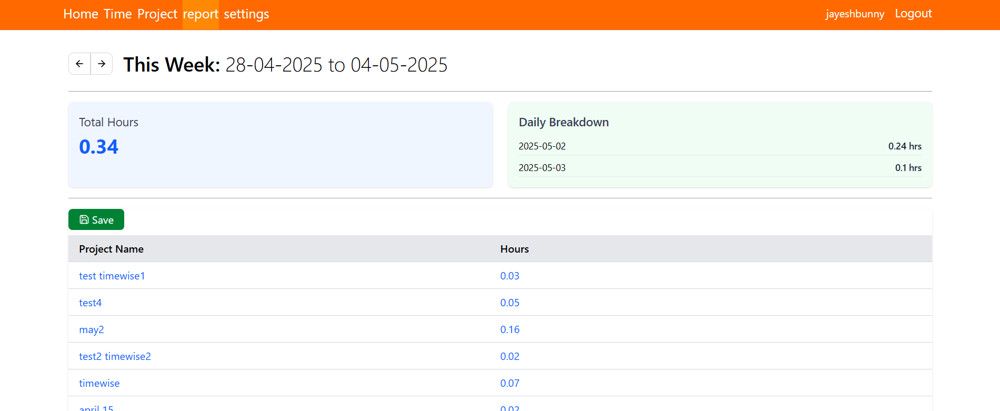

# ⏱️ TimeWise – Effortless Time Tracking & Reporting

TimeWise is a smart, full-stack web application built to help individuals and teams track time spent on projects, log entries, and generate insightful time reports — all in one place.

Live Demo: [https://timewise-beta.vercel.app](https://timewise-beta.vercel.app)

---

## 📸 Preview

 

---

## 🚀 Features

- 🔐 Google & email/password login via NextAuth
- 👤 Secure user authentication & session handling
- 📁 Project creation and management
- 🕒 Track time entries with project link, start time, end time, and auto-calculated duration
- 📊 View all time logs with basic filtering
- ⚡ Responsive UI optimized for productivity

---

## 🛠️ Tech Stack

| Layer        | Technology                     |
|--------------|-------------------------------|
| Frontend     | Next.js 14 (App Router)        |
| Styling      | Tailwind CSS                   |
| Auth         | NextAuth (Google + Credentials)|
| ORM          | Prisma                         |
| Database     | PostgreSQL via Railway         |
| Hosting      | Vercel (Frontend)              |
| Dev Tools    | TypeScript, ESLint, Prettier   |

---
